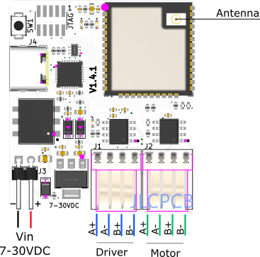

# BLE STEPPER MOTOR ANALYZER

TODO: Add a picture of the device

TODO: Add a screen shot of the desktop app

<video width="320" height="240" controls>
  <source src="./www/app_video.mp4" type="video/mp4">
</video>

## Description

The BLE Stepper Motor Analyzer ('the analyzer') is a low-cost, open source system that analyzes stepper motor signals and display the the data in real time on a computer screen. The system includes two components.

1. The Stepper Motor Probe ('the device'). This is a small electronic board that monitors the currents through the stepper motor wires, extracts information such as steps, and speed, and transmits the data via Bluetooth BLE.
2. The Analyzer App ('the app'). This is a Python program that runs on a Windows, MaC OSX, or Linux PC, and displays the stepper information in real time in a graphical view.

## Highlights
* The device is passive and doesn't not interfere with the operation of the stepper, regardless if the device is in use or turned off.
* Embedding the device in a 3D printer is easy. It is small, operates on 7-30 VDC, 1W, and uses a small external sticker antenna.
* The entire design is in the public domain and can be used commercially with no attribution or open source requirements.
* The electronic design is based on common components such that the device can be ordered fully assembled from JLCPCB SMT service (about $12/unit in quantities of 30, as of Feb 2023)
* The device firmware can be updated by users using a standard USB cable, no other tools required.
* Each device has its own unique address such that multiple devices can be used in parallel to monitor multiple stepper motors.
* An open Python API allows to write custom monitoring apps.

## How does it work?
The device contains two galvanic isolated current sensors that measure the current through the two stepper motor coils 40,000 times a second, a firmware that analyze the current readings and tracks information such as step count, and speed, and a Bluetooth BLE radio unit which transmits this information to the app which displays it with visual graphs.  

## Specification

Item | Specification
:------------ | :-------------
Power consumption | 7-30 VDC, 1W.
Firmware update connector | USB Type C
SOIC Module | ESP32-WROOM-32U-N4 
Current measurement | +/-2.5A per coil.
PCB | 39mm x 43mm, two layers
Antenna  | 2.4Ghz external antenna IPX IPEX connector.
Sensor isolation | See CC6920BSO-5A datasheet
Zero calibration | Using onboard button.
Count direction | User selected, 
Sampling rate | 40Khz per channel.
Sampling resolution | 12bits
Current accuracy | estimated at +/- 2%
Max step rate | 5K full steps/sec.
Step resolution | 1/10th of a full step.
Firmware programming language | C++
Firmware programming IDE | VSCode, Platformio, esdidf framework.
Firmware debugging | Via optional 10 pins JTAG connector.
Electronic design software | Kicad.
Mechanical design software | Onshape.
Open source license | Creative Commons CC0.

## Building your own device

1. Order assembled boards (recommended), or just the just bare PCB and assembled the components yourself. Production files for JLCPCB PCB and SMT service are included here.
2. Connect the device to a computer via a USB cable and notice that one LED turn on solid to indicate 3.3V power.
3. Flash the firmware to the device and notice that the second LED blinks every second or so, This indicates that the firmware is running and that the device is not connected to the app.
3. Calibrate the zero level of the current sensor by pressing on the switch a few seconds until the third LED will blink 3 times, indicating that the zero calibration was saved.
4. Connect an antenna and run the analyzer app to verify that it can connect to the device.
5. The device is not ready for installation in the 3D printer.

## Installing the device in your 3D printer

1. 3D print a device carrier (STL models provided here) and attach the device to the carrier using two pieces of 3M VHB 1mm sticky tape or similar.
2. Attach the device carrier to the 3D printer using and additional piece of 3M VHB tape.
3. Connect the external antenna connector and attach the antenna to the outside of the printer.
4. Connect the driver and motor wires per the wiring diagram below. The two connectors are pass-through such that the signals from the driver are connected internally to their respective motor signals. (It's OK to swap between the two stepper motor connectors, the device will work just the same).
5. Connect the power input of the device to a power source (7-30VDC). Pay attention to the polarity.  (The device contains reverse polarity protection). 
6. Leave the USB connector unconnected. It is not used in normal operation of the device and should be used for firmware flashing only.
7. Your device installation is complete. You can use your 3D printer just the same, regardless if you use the analyzer app.

&nbsp;

  Wiring Diagram  
  

## Operating the Analyzer app.

## Flashing a firmware update

TBD (using the esptool or ESP Web Tools, and the firmware provided here)

## Firmware developement

## Analyzer app developement

## FAQ

Q: I want to monitor multiple motors in my 3D printer. Can I do it?
A: Of course. Simply install a a device for each stepper motor you want to monitor.

&nbsp;

Q: I am using multiple devices, how can I select which one I connect to?  
A: Each devices has a factory set unique address that looks like <i>0C:8B:95:F2:B4:36</i>. When you run the analyzer
app, you can specify the address of the device you want to monitor by adding a command line flag such as <i>-d 0C:8B:95:F2:B4:36</i>

Q: How far can my computer be away from my 3D printer?  
A: Bluetooth BLE radio communication is intended for short distances of a few yards. If the radio link will not be reliable, the analyzer program will detect data gaps and will report it in its console log.

Q: This system can be a great idea for a Crowd Compute campaign. Can I do that?  
A: Of course. The design is in public domain and commercial usages are encouraged. Attribution and sharing any changes you make are not required. 

Q: Do the designer fo this product also sell assembled boards?  
A: We may make a limited numbers of boards available from time to time, but believe that others can do a better job mass producing it.

Q: Can the external antenna be eliminated to simplify installation and reduce cost?  
A: Yes. We believe that the ESP module ESP32-WROOM-32D-N4 which uses an internal antenna should be a drop-in replacement though we did not tested it.

