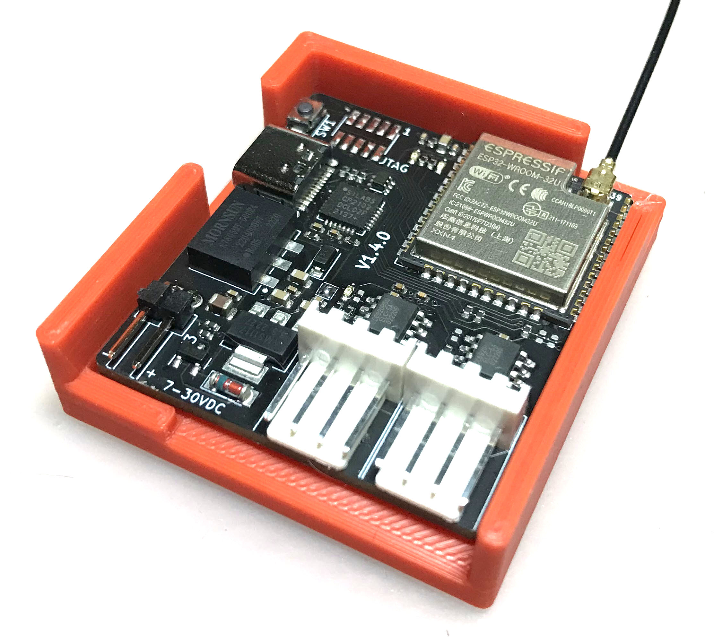
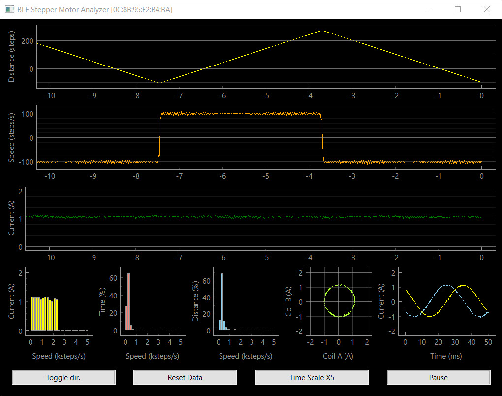
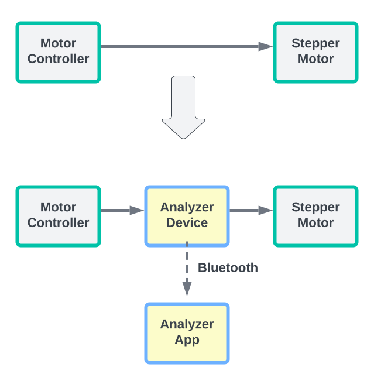
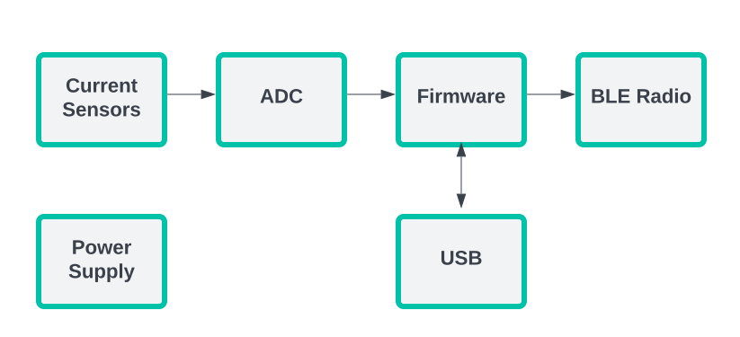
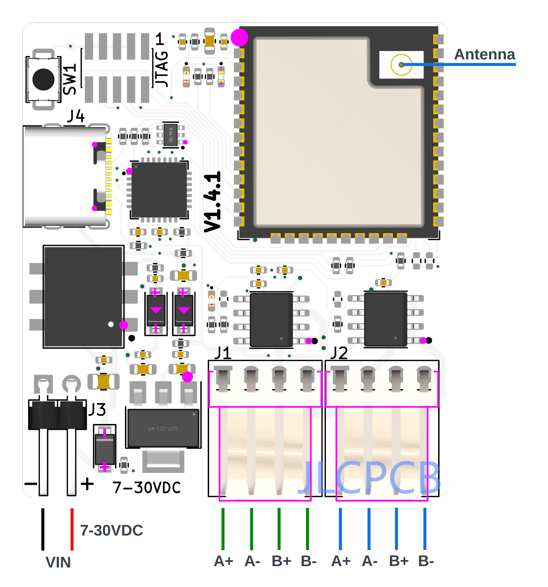
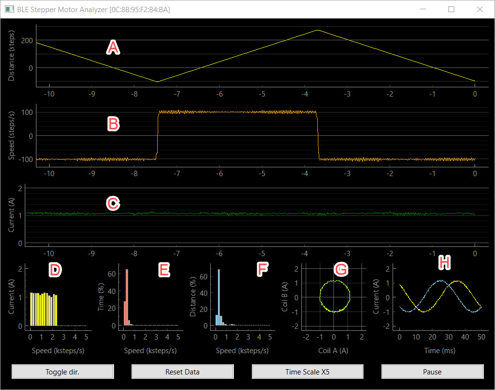
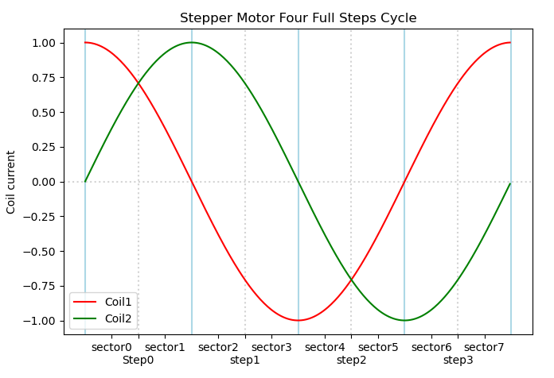
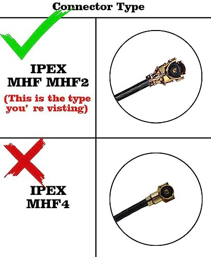
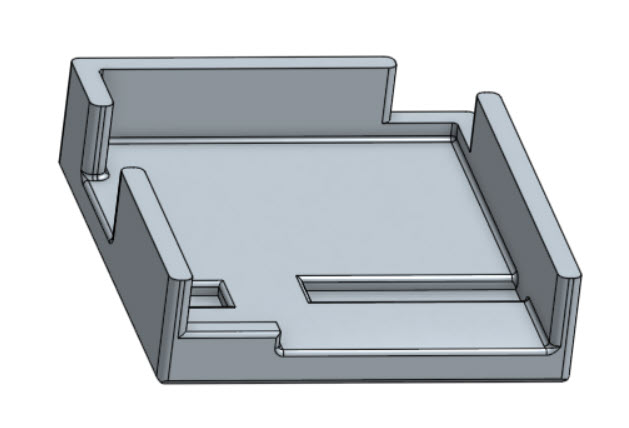
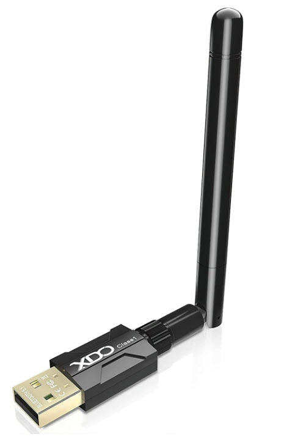

# BLE STEPPER MOTOR ANALYZER

> **_NOTE:_** As for June 2023, a **productized version of a BLE Stepper Motor analyzer is available*** at https://vector3d.co.uk/product/stepper-motor-analyser/ and is firmware and software compatible with the reference design here. While we are not involved with that commercial offering, we do support such initiatives of making the technology available to the community, and will be happy to provide here technical support as much as we can.

> **_NOTE:_** As for June 24th 2023, added under the spec table a discussion regarding the **max stepper voltage** that can be used.

------

<p align="center">
  <br>
  The analyzer device of the reference design here<br>
  
</p>

<p align="center">
  The analyzer's app<br>
  
</p>


**A short video** of the app is available here https://vimeo.com/798169140

---
- [BLE STEPPER MOTOR ANALYZER](#ble-stepper-motor-analyzer)
  - [Description](#description)
  - [Design Highlights](#design-highlights)
  - [How does it work?](#how-does-it-work)
  - [Specification](#specification)
  - [Installing the device in your 3D printer](#installing-the-device-in-your-3d-printer)
  - [Using the Analyzer app.](#using-the-analyzer-app)
    - [Running the Analyzer app using a provided binary](#running-the-analyzer-app-using-a-provided-binary)
    - [Running the Analyzer app using the Python source files](#running-the-analyzer-app-using-the-python-source-files)
    - [Understanding the Analyzer app screen](#understanding-the-analyzer-app-screen)
    - [The Analyzer app buttons](#the-analyzer-app-buttons)
    - [Analyzer app command line flags](#analyzer-app-command-line-flags)
  - [Updating the firmware](#updating-the-firmware)
  - [Building your own device](#building-your-own-device)
  - [Antenna selection](#antenna-selection)
  - [Connectors](#connectors)
  - [3D Models](#3d-models)
  - [Troubleshooting connection issues](#troubleshooting-connection-issues)
  - [Hardware design files](#hardware-design-files)
  - [Firmware development](#firmware-development)
  - [Analyzer App Python development](#analyzer-app-python-development)
  - [FAQ](#faq)

---

## Description

The BLE Stepper Motor Analyzer ('the analyzer') is a low-cost, open source system that analyzes stepper motor signals and display the the data in real time on a computer screen. The system includes two parts:

1. **The Stepper Motor Probe** ('the device'). This is a small electronic board that monitors the currents through the stepper motor wires, extracts information such as steps, and speed, and transmits the data via Bluetooth BLE.

2. **The Analyzer App** ('the app'). This is a Python program that runs on a Windows, MaC OSX, or Linux PC, and displays the stepper information in real time in a graphical view.

The following block diagram shows how the device and the app related to the controller and stepper motor of an existing system such as a 3D printer. 

<p align="center">
 System Block diagram<br>
  
</p>

## Design Highlights
* The device is passive and does not interfere with the operation of the stepper motor, regardless if it is in use or turned off. Furthermore, the stepper signals are galvanically isolated from the electronics.
* Embedding the device in a 3D printer is simple. It has a small footprint, operates on 7-30 VDC, and can use a small external sticker antenna that overcomes shielding by the printer enclosure.
* The design is in the public domain (Creative Commons CC0) and can be used also commercially. Attribution and code sharing are not required.
* The device design is low cost and can be ordered fully assembled from JLCPCB or similar services.
* The device firmware can upgraded by users using a standard USB cable, no tools or adapter required.
* Each device has its fixed unique address such that multiple devices can be used and addressed independently (e.g. one for each stepper motor in your printer).
* Open BLE and Python APIs supports custom monitoring apps, such as specialized analyzers or mobile apps.

## How does it work?
The device contains two galvanic isolated current sensors that sense the currents through the two stepper coils. These values are measured 40,000 times a second and firmware on the device analyzes them and extracts information such as step count, speed, and current patterns. A Bluetooth BLE radio then transmits the data to the app which displays it in a graphical form.

 <p align="center">
 Device Block diagram<br>
  
</p>


## Specification

| Item                          | Specification                                          |
| :---------------------------- | :----------------------------------------------------- |
| Supply voltage                | 7-30 VDC                                               |
| Stepper motor voltage         | See note below                                         |
| Power consumption             | 1W max                                                 |
| Firmware update connector     | USB Type C.                                            |
| SOIC Module                   | ESP32-WROOM-32U-N4.                                    |
| Current measurement           | +/-2.5A per coil.                                      |
| PCB                           | 39mm x 43mm, two layers.                               |
| Antenna                       | 2.4Ghz external antenna IPX IPEX connector.            |
| Simultaneous connections      | 1 max.                                                 |
| Protocol                      | BLE 4.1 or higher, with Data Length Extension feature. |
| Current sensors               | CC6920BSO-5A                                           |
| Zero calibration              | Using onboard button.                                  |
| Count direction               | User selected (doesn't change motor direction).        |
| Sampling rate                 | 40Khz per channel.                                     |
| Sampling resolution           | 12bits.                                                |
| Current accuracy              | estimated at +/- 2%.                                   |
| Max step rate                 | 5K full steps/sec.                                     |
| Step resolution               | 1/100th of a full step.                                |
| Firmware programming language | C++                                                    |
| Firmware programming IDE      | VSCode, Platformio, ESPIDF framework.                  |
| Firmware debugging            | Via optional 10 pins JTAG connector.                   |
| Electronic design tool        | Kicad.                                                 |
| Mechanical design tool        | Onshape.                                               |
| Open source license           | Creative Commons CC0.                                  |

> **_NOTE:_**  The analyzer uses current sensors CC6920BSO-5A current
sensors which provides galvanic isolation between the stepper motor wires and the circuitry and input voltage of the analyzer. As a result, the stepper motor voltage is not limited, and is independent, of the supply voltage. While the sensors are specified as 3500V RMS isolation, the PCB was definitely not designed for that voltage in mind and use only 6mil clearance between the traces. Some information on the internet such as https://www.smpspowersupply.com/ipc2221pcbclearance.html suggests that this qualifies it to 50 or even 100v, but since we are not safety experts, we tested it with only 24V steppers.


## Installing the device in your 3D printer

1. Print a device carrier using a 3D printer (STL model included here) and attach the device to the carrier using two pieces of 3M VHB 1mm sticky tape or similar.
2. Attach the device carrier to the 3D printer using an additional piece of 3M VHB tape.
3. Connect the external antenna and attach the antenna to the outside of the printer.
4. Connect the motor driver and stepper motor to the two connectors as shown in the wiring diagram below. The two connectors form a path through path, such that one pair of adjacent pins are used for one coil and the other pair for the second coil.
5. Connect 7-30VDC power to the VIN connector of the device. Pay attention to polarity, though the device will not get damaged by reverse polarity. 
6. Do not connect anything to the USB connector. This connector is intended for firmware flashing only.
7. The device installation is complete. You can use your 3D printer just as you did before, regardless if the analyzer app is active or not. To monitor the stepper while your printer is turned on, use the provided analyzer app on your Windows, Mac, or Linux PC as described below. 

&nbsp;

<p align="center">
  Wiring Diagram<br>
  
</p>

## Using the Analyzer app.

### Running the Analyzer app using a provided binary
The simplest way to run the analyzer app on your computer is to look for an  executable file for your system under the 'release' directory in this repository. They also released as 'release.zip' file.

> **_NOTE:_**  The single binary files are created from the app's Python code using the Pyinstaller tool and the scripts in the python/pyinstaller directory.

### Running the Analyzer app using the Python source files
If a single app binary is not available for your system, or if you prefer to run the Python code directly, you will first need to do a few preparation to satisfy the prerequisites of the Python code.

1. Install Python on your computer. Prefer the latest stable version.
2. Clone the repository on your computer or download and extract the 'python.zip' release file.
3. Install the required python modules by running this command the 'python' directory :
   
```
pip install -r requirements.txt
```
4. Make sure that your analyzer device is powered on and start the app using the command

```
python analyzer.py
```

> **_NOTE:_**  When the device is idle, its LED blink at a rate of about 1 blink per second. When connected to the app, it blink faster about 3 blinks per second. The app can connect to a device only when it's idle as indicated by the slower blink rate.

### Understanding the Analyzer app screen

<p align="center">
  
</p>

The apps screen contains the following graphs

* [A]. A rolling chart with distance in steps. Updated 50 times a second.
* [B]. A rolling chart with speed in steps/sec. Updated 50 times a second.
* [C]. A rolling chart with stepper absolute current in Amps. Updated 50 times a second. The absolute current of a stepper is sqrt(A^2 + B^2) where A and B are the momentary currents of coils A, B respectively.
* [D] A histogram of current vs speed that shows how well the driver is able to maintain the stepper current at various speeds. High coil inductance of low power voltage result in significant current level at higher speeds.
* [E] A histogram that shows the relative time spent in each speed range.
* [F] A histogram that shows the relative distance done in each speed range.
* [G] A phase (Lissajous curve) graph that shows the 'cleanliness' of the sine/cosine current signals the driver sends to the motor.
* [H] An oscilloscope graph that shows current samples from the two coils. During stepper movement in a constant speed, they should look like sine/cosine waves. 

> **_NOTE:_**  In the oscilloscope graph, a single sine or cosine cycle represents 4 stepper full steps, as shown in the graph below.

<p align="center">
  
</p>

### The Analyzer app buttons
The Analyzer app contain the button listed below. 

> **_NOTE:_**  The buttons affect the app only and do not interfere with the operation of the motor.

* **Toggle Dir** - Click to change the direction of step counting.
* **Reset Data** - Click to clear the histograms and step count.
* **Time Scale X** - Click to toggle the sampling time of the signals shown in the phase graph [G] and oscilloscope graph [H] to match the movement speed. As a rule of thumb, you want to have at least one full sine/cosine wave, with higher values for slower stepper movements.
* **Pause** - Click to pause/resume the display. Useful examine interesting captured data.

> **_NOTE:_** The graphs are implemented using pyqtgraph and thus provide additional functionality that is accessible by a right mouse click on the graphs.


### Analyzer app command line flags

**--help** Prints a list with the available flags.

**--scan** The analyzer will scan for BLE devices for a few seconds, print a list of  devices it found and exit. This intended for diagnostics. The stepper motor analyzer devices have names that look like <si>STP-0C8B95F2B436</i>.

```
python analyzer.py --scan
```


**--device** Instructs the analyzer to not search on start for available devices, and instead, connect to the device with given name directly. If you set in the device a nick name using the --set-nickname flag below, you can also use that nickname as a value of the --device falg. 

```
python analyzer.py --device "STP-0C8B95F2B436"

python analyzer.py --device "X-AXIS"
```

**--set_nickname** Running the analyzer with this flags sets on the device a user friendly nickname that can be used as an alternative value for the *--device* flag. That nickname is also shown in the title of the Analyzer graphical view.

```
python analyzer.py --set_nickname "X-Axis"
```

**--max-amps** If you monitor a low current stepper motor such as a 600ma extruder motor, you can use this flag to limit the range of the current display in the Phase and Oscilloscope graphs, to zoom in on details.
```
python analyzer.py --max-amps 0.8
```

***--units*** The default units for stepper distance or rotation are full steps. You can use this flag to display other units such as mm, degrees, or extrusion mm^3. 
```
python analyzer.py --units "mm"

python analyzer.py --units "degrees"

python analyzer.py --units "mm^3"
```

**--steps_per_unit** If you are using the **--units** flag, use this flag to specify the number of full motor steps that correspond to one unit. For example, if your extruder esteps value is 540 micro steps per mm, with 16 microsteps per full step, specify the flags below:
```
python analyzer.py --units=mm --steps_per_unit 33.75
```

## Updating the firmware

To flash a firmware version follow these steps.

1. Download the release.zip file of the desired release and extract it.
2. Disconnect the power connector of the device and connect it to your computer using a USB cable.
3. Run the flash script for your Windows, Mac or Linux computer. For example:
```
flash.bat
```
 4. Verify that the the script completed with no errors and that the LED on the device is blinking at about one blink per second. The device with the new firmware is ready.

## Building your own device

1. Order assembled boards (recommended), or just order bare PCBs and assemble the components yourself. Production files for JLCPCB PCB, including for the SMT service are included in this repository.
2. Connect the device to a computer via a USB cable and notice that one LED turn on solid to indicate 3.3V power.
3. Flash the device with firmware as explained above.
4. Calibrate the current sensors for zero level by long pressing the switch until the second LED will blink 3 times to indicate that the calibration values were saved in the non volatile memory.
5. Connect an antenna, run an analyzer program as explain above and that you see some signals from the device. The LED on the device will blink faster to indicate an active connection.
6. The device is now ready for installation in the 3D printer or for shipping to your customers.

* **Schematic**: https://github.com/zapta/ble_stepper_motor_analyzer/blob/main/kicad/stepper_monitor.pdf
* **JLCPCB production files**: https://github.com/zapta/ble_stepper_motor_analyzer/tree/main/kicad/JLCPCB


> **_NOTE:_**  Resistor R16 acts as a jumper and allows to disconnect the 3.3V supply from the rest of the electronics. This is useful when diagnosing power issues.

## Antenna selection

The external antenna should  satisfy these requirements:
* Specified for the Bluetooth band of 2.4GHZ.
* Having a connector that match the ESP32 WROOM module. The connector has several names including IPEX, U.FL, or MHF1, but it's easier to distinguish it by its wider body.

<p align="center">
  
</p>

<p align="center">
  Inexpensive Aliexpress sticker antennas.<br>
  
</p>

## Connectors

* **Stepper Motor Connectors** - KF2510 connector 2.54mm pitch, female, 4 wires.
* **Vin connector** - Dupont 2.54mm pitch, female, 2 wires. 

## 3D Models

3D Models of the carrier and a cover for shipping are available at https://github.com/zapta/ble_stepper_motor_analyzer/tree/main/3D

<p align="center">
  
</p>


## Troubleshooting connection issues

The analyzer requires on the PC side support for Bluetooth BLE 4.1 or higher with support for the Data Length Extension feature. It is expected that most computer come with a built in adapters that support
this standard, but we also observed a very low cost BeeLink mini computer that came with an old internal Bluetooth adapter that doesn't support this standard.

The workaround in this case is to **disable the internal Bluetooth adapter** and use an **external USB Bluetooth adapter** that has an external antenna for better range. For example we had good result with this adapter that as of 2023 cost about $15 https://www.amazon.com/gp/product/B09KGVFX1K, which is based on the RTL876B chip.

<p align="center">
  
</p>

> **_NOTE:_**  Installing a RTL876B based adapter on Ubuntu requires a minor tweak of the firmware file names as explained at https://fosspost.org/fix-bluetooth-rtl8761b-problem-on-linux-ubuntu-22-04/. Also, 

The symptoms of a PC bluetooth adapter that doesn't support the required protocol are that the device shows up when running *analyzer --scan* but when running the analyzer without the *--scan* flag, it fails to connect to the device.  For the more technical readers, a discussion on this topic is available here https://github.com/hbldh/bleak/issues/1227#issuecomment-1435708347

## Hardware design files

The Kicad source files and the generated JLCPCB production files are available under the *kicad* directory of this repository. As of Mar 2023, we are using Kicad 7.0, and the built in plugins **Fabrication Toolkit** and **Interactive Html Bom**.

## Firmware development

This list below outlines the steps to set up your own firmware development environment.

1. Install Visual Studio Code (VSC).
2. In Visual Studio Code, enable the <i>platformio</i> extension.
3. Download or clone this git repository on your computer.
4. In VSC, select <i>File | Open Folder</i> and select the 'platformio' directory.
5. Connect a device to your computer using a USB cable. This will create a serial port on your computer.
6. Click on the platformio <i>Upload</i> icon at the bottom of the screen (right arrow icon) and platformio will automatically install all the dependencies, build the project, and upload it to your device via the serial port.  
7. For more information on how to use platformio, check http://platformio.org.

> **_NOTE:_**  For optional hardware debugging (breakpoints, single step, etc), you will need an Espressif ESP-Prog Development Board, and to solder on your device a 10 pins JTAG connector.

> **_NOTE:_** It's OK to connect a stepper motor to the device while you develope code since the stepper signals are galvanically isolated from the USB interface and from your computer.

> **_NOTE:_** It is recommended to not connect VIN and the USB connectors at the same time to avoid ground loop, in case both the Vin power supply and your computer are grounded independently.


## Analyzer App Python development

The Analyzer's Python app is stored in the 'python/analyzer' directory and uses a library at python/common. The app is based on Bleak (BLE client) PyQtGraph (a graphing library) and uses asyncio for non blocking background operation. The list of requires python modules is in requirements.txt and they can be installed using the command

```
pip install -r requirements.txt
```

## FAQ

**Q**: This is an exciting project, can I help?

A: Of course, contribution of code, documentation, test programs or ideas are welcome.

---

**Q**: I want to monitor multiple motors in my 3D printer. Is it possible?

**A**: Of course. Simply install a device for each stepper motor you want to monitor. 

---

**Q**: I am using multiple devices, how can I select which one I connect to? 

**A**: Each device has a fixed unique name such STP-0C8B95F2B436. When you run the analyzer app, it will allow you to select a device, if more than one are available, or you can use the --device flag to force a specific device.

---

**Q**: How far can my computer be away from my 3D printer? 

**A**: Bluetooth BLE radio communication is intended for short distances of a few yards. If the radio link will not be reliable, the analyzer program will detect data gaps and will report it in its console log.

---

**Q**: This system can be a great idea for a Crowd Compute campaign. Can I do that? 

**A**: Of course. The design is in public domain and commercial usages are encouraged. Attribution and sharing of modification you make are not required. 

---

**Q**: Do you sell boards? 

**A**: We may produce a limited numbers of boards from time to time, but we also believe that others can do a better job job of mass producing and making it available to the community.

---

**Q**: Can the external antenna be eliminated to simplify installation and reduce cost? 

**A**: Yes. We believe that the ESP module ESP32-WROOM-32D-N4 which uses an internal antenna should be a drop-in replacement though we did not have the chance yet to test it.

---
